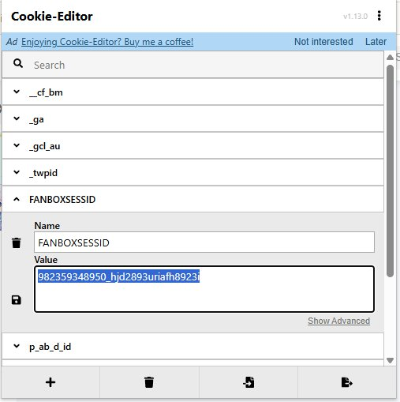

# FanFan Gallery-DL

**Stop losing content. Stop re-downloading everything. Stop guessing what you're missing.**

FanFan Gallery-DL is a Windows desktop app for downloading media from Pixiv Fanbox and Fantia. Scan a creator, see every post they've ever made, pick exactly what you want, and download it — with a consistent naming system so you always know what you have.

Built on [gallery-dl](https://github.com/mikf/gallery-dl). Designed for people who actually care about their collections.


---

## The Problem

You subscribe to creators on Fanbox and Fantia. You download their content. But then:

- You can't remember what you already have
- You accidentally re-download files you already saved
- A creator posts 50 things and you only want 3 — but the tools download everything or nothing
- You deleted some files and now you've lost track of what's missing
- Your folders are a mess of random filenames that mean nothing

Sound familiar?

---

## The Solution

### Scan before you download

See every post a creator has made — with titles, dates, prices, file counts, and lock status — before downloading a single byte. Posts are color-coded: green for accessible, orange for locked/paywalled.


### Pick exactly what you want

Check the posts you want, uncheck the rest. Filter by date, search by name or post ID, sort by date/title/tier/file count. Download only what you selected — one click, one queue item, one progress bar.

### Cross-Check what you have

The killer feature. Scan a creator, point to your local folder, and instantly see what's missing, what's already there, and what's locked behind a paywall. Then download only the gaps.


### Universal Standard naming

Every file gets a consistent, predictable name:

```
Whitefish しろサカナ [2026-02-24] Ocean Series - Herring 01 [P11458849] [Fanbox].mp4
```

This means:
- Your file explorer sorts everything chronologically, automatically
- You can trace any file back to its original post
- You'll never have duplicate files again
- Cross-Check works by matching the `[P{post_id}]` token — no post ID, no match

---

## Supported Platforms

| Platform | Status |
|----------|--------|
| Pixiv Fanbox | ✓ Tested |
| Fantia | ✓ Tested |

---

## How to Install

1. Go to the [Releases page](https://github.com/shioneko2026/fanfan-gallery-dl/releases) and download the latest `.zip` — then extract it anywhere
2. Install [Python 3.9+](https://www.python.org/downloads/) — **on the first installer screen, check "Add Python to PATH"** or the app won't run
3. Double-click **`Install Dependencies for FanFan Gallery-DL.bat`** — wait for the success message
4. Double-click **`START FanFan Gallery-DL.bat`**

Gallery-dl (the download engine) installs itself automatically on first launch.

> **First time?** Before downloading anything, go to **Settings → Credentials** and set up your cookies for each platform. The app walks you through it.

---

## How to Use

### 1. Set up your cookies

The app needs your browser cookies to access your subscriptions. Cookies are small pieces of data your browser stores when you log into a website — they prove you're logged in. FanFan uses these to download content you've paid for. Without them, it can only see free posts.

#### How to get your cookies

1. **Install Cookie-Editor** — a free browser extension
   - [Chrome / Edge / Brave / Vivaldi](https://chromewebstore.google.com/detail/cookie-editor/hlkenndednhfkekhgcdicdfddnkalmdm)
   - [Firefox](https://addons.mozilla.org/en-US/firefox/addon/cookie-editor/)
   - Or visit [cookie-editor.com](https://cookie-editor.com/) and click Install

2. **Log into your platform** — go to Fanbox, Fantia, etc. in your browser and make sure you're signed in with an active subscription

3. **Open Cookie-Editor** — click the cookie icon in your browser toolbar while on the platform's website

4. **Find the right cookie** — scroll through the list and look for:
   - **Fanbox:** `FANBOXSESSID`
   - **Fantia:** `_session_id`

5. **Copy the value** — click the cookie name to expand it, then copy the **Value** field (the long string of letters and numbers)

   <p align="center">
   <br>
   <em>Cookie-Editor showing the FANBOXSESSID cookie. Screenshot via <a href="https://cookie-editor.com/">Cookie-Editor</a> by cgagnier.</em>
   </p>

6. **Paste into FanFan** — open the app, go to **Settings → Credentials**, select the platform tab, paste the value into the cookie field, and click **Save Cookies**

7. **Test it** — click **Test Connection** and pick any creator you're subscribed to. If it says "Connection successful," you're good to go.

> **Cookies expire every few weeks.** When downloads start failing with auth errors, just repeat steps 2–6 to refresh them. The app will tell you when cookies are expired (v0.10.0+).

### 2. Add your creators (optional but recommended)

Go to the **Creators** tab and click **+ Add Creator**. Fill in their display name, the platform URLs you want to download from, and a local folder to save to.

Once added, hitting **Download** on a creator card takes you straight to the Downloader with everything pre-filled.


### 3. Scan a creator

Go to the **Downloader** tab. Either select a creator from the dropdown or paste their profile URL directly.

Hit **Scan**. The App Log will show each post as it's found — title and date streaming in live. Depending on how many posts they have, this can take anywhere from a few seconds to a minute.


Posts are color-coded:
- **Green** — paid post, you have access
- **Orange** — locked (subscriber-only tier you're not on)
- **Black** — free post

### 4. Select and download

Check the posts you want. Use **Deselect image-only posts** to quickly clear posts with no video. Use the search box or date filters to narrow things down.

When you're ready, hit **Download Selected**. One queue item is created — check the **Download Queue** tab to watch progress.


### 5. Cross-Check (find what you're missing)

Already have some files downloaded? Go to **Cross-Check**, paste the creator URL, point it at your local folder, and hit **Cross-Check**.

It'll tell you exactly what's **Present**, what's **Missing**, and what's **Locked**. Hit **Download Missing** to grab only the gaps.


> Cross-Check requires files named with the Universal Standard pattern (the default). Files downloaded before using FanFan, or with custom naming, won't be matched.

---

## Features

### Downloader

- Scan a creator URL and preview every post in a sortable table
- Expand any post to see its full file list (videos, images, archives)
- Color-coded posts: green = paid/accessible, orange = locked, black = free
- Date range filters, name search, Post ID search
- Sort by date, title, tier, or file count
- "Deselect image-only posts" — one click to clear posts with no video
- "All videos to one folder" — flatten everything into a single directory
- Abort Scan — cancel a running scan at any time; live progress shown in App Log as posts stream in

### Download Queue

- One queue item per scan — clean, accurate progress tracking
- Abort any download mid-way; re-download from the same scan without rescanning
- App Log shows filenames and download speed as files complete
- Beep notification when scan or download finishes
- ZIP auto-extraction with Universal Standard naming applied to extracted files *(experimental — not fully tested)*


### Cross-Check

- Compare any creator scan against your local download folder
- Instant status per post: Present / Missing / Locked
- Download only the missing posts with one click
- Works via `[P{post_id}]` token matching — requires Universal Standard naming

### Creators

- Multi-platform creator profiles (Fanbox + Fantia in one entry)
- Per-creator download folder, display name, and Japanese name
- Cookies tested per-platform from the creator card
- Filter and sort the creator list by platform


### Settings

- **General** — notification sounds (frequency, volume)
- **Downloader** — default save folder, concurrent downloads, per-platform rate limit / sleep delay / retry count
- **Naming** — naming presets; save and switch between folder/file patterns; Universal Standard preset built-in
- **Credentials** — step-by-step cookie guide per platform using Cookie-Editor extension; cookies stored in Windows Credential Manager

---

## Known Limitations

| Limitation | Details |
|-----------|---------|
| **No per-file selection** | You select posts, not individual files within a post. The file list under each post is preview only. |
| **No file sizes before download** | Scan mode returns filenames and metadata but not sizes. |
| **Downloads are slow by default — intentional** | Gallery-dl enforces sleep delays between requests to avoid rate-limiting. Default is 1.0s between files on Fanbox/Fantia. A post with 50 files takes ~50s minimum. Adjustable in Settings → Downloader, at your own risk. |
| **Downloader settings are untested** | Per-platform rate/sleep/retry controls are new and haven't been extensively tested in practice. Use defaults until you're confident. |
| **ZIP extraction is experimental** | Archives are auto-extracted after download, but this feature is not fully tested. Extraction may fail silently or produce unexpected results — check the App Log. |
| **Verification count may include locked posts** | The post-download verification count reflects all posts gallery-dl scanned, which may include locked posts that were skipped. This is a known issue. |
| **Windows only** | Uses Windows Credential Manager for cookie storage and `winsound` for notifications. |

---

## Why Universal Standard Matters

This is not just a naming convention. It's a system.

When your files are named `Whitefish しろサカナ [2026-02-24] Ocean Series - Herring 01 [P11458849] [Fanbox].mp4`, you get:

1. **Self-describing files** — move them anywhere, they still tell you everything
2. **Chronological sorting** — your OS sorts by date automatically
3. **Cross-checking** — the app matches post IDs to find what's missing
4. **No duplicates** — identical content produces identical filenames

---

## Requirements

- Python 3.9+
- Windows 10/11
- Active subscription cookies for your target platforms

---

## Credits

**Built on [gallery-dl](https://github.com/mikf/gallery-dl)** by mikf — the download engine handling all authentication and downloading. FanFan Gallery-DL would not exist without it.

**Inspired by [Cultured Downloader](https://github.com/KJHJason/Cultured-Downloader)** by KJHJason.

---

## License

[MIT](LICENSE)
