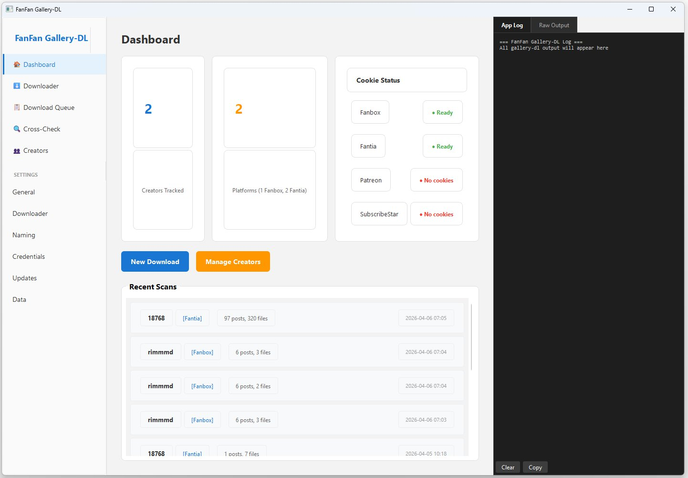
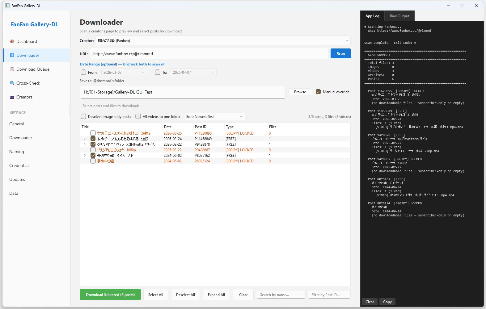
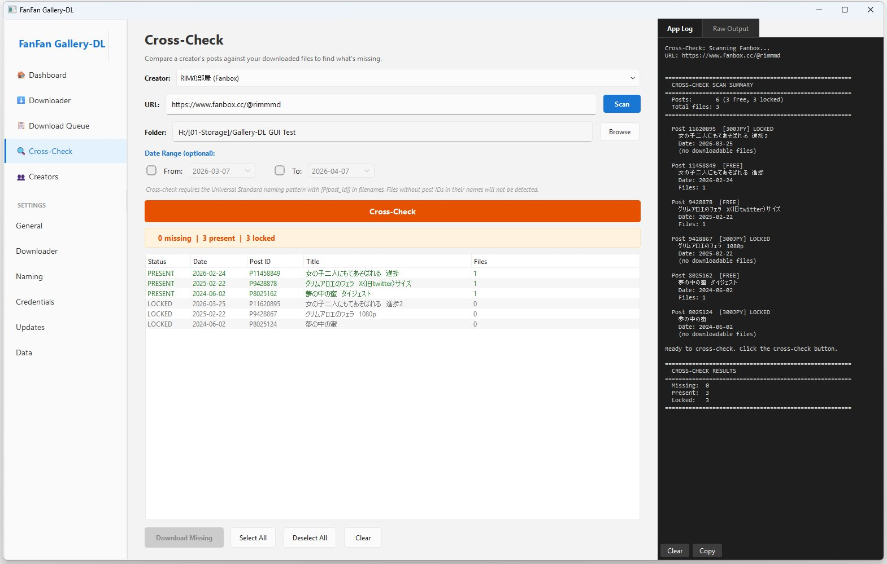
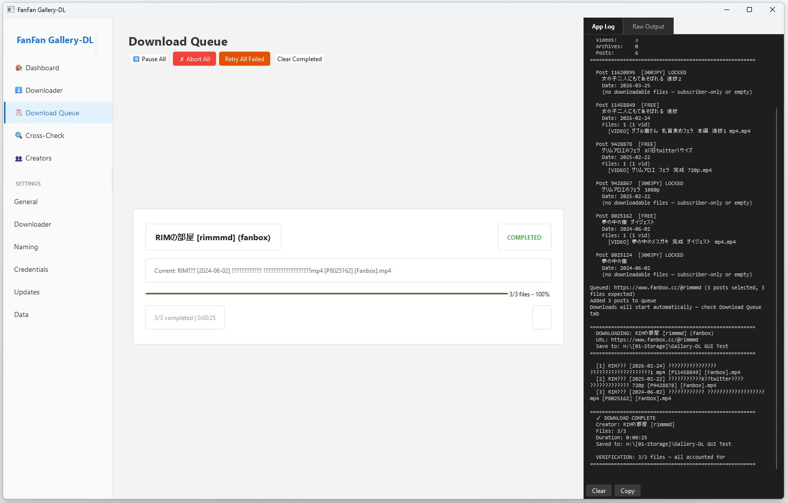
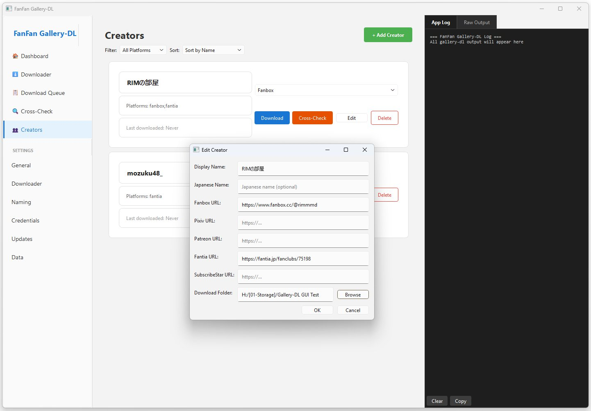

# FanFan Gallery-DL

**Stop losing content. Stop re-downloading everything. Stop guessing what you're missing.**

FanFan Gallery-DL is a Windows desktop app for downloading media from Pixiv Fanbox and Fantia. Scan a creator, see every post they've ever made, pick exactly what you want, and download it — with a consistent naming system so you always know what you have.

Built on [gallery-dl](https://github.com/mikf/gallery-dl). Designed for people who actually care about their collections.



---

## The Problem

You subscribe to creators on Fanbox and Fantia. You download their content. But then:

- You can't remember what you already have
- You accidentally re-download files you already saved
- A creator posts 50 things and you only want 3 — but the tools download everything or nothing
- You deleted some files and now you've lost track of what's missing
- Your folders are a mess of random filenames that mean nothing

Sound familiar?

---

## The Solution

### Scan before you download

See every post a creator has made — with titles, dates, prices, file counts, and lock status — before downloading a single byte. Posts are color-coded: green for accessible, orange for locked/paywalled.



### Pick exactly what you want

Check the posts you want, uncheck the rest. Filter by date, search by name or post ID, sort by date/title/tier/file count. Download only what you selected — one click, one queue item, one progress bar.

### Cross-Check what you have

The killer feature. Scan a creator, point to your local folder, and instantly see what's missing, what's already there, and what's locked behind a paywall. Then download only the gaps.



### Universal Standard naming

Every file gets a consistent, predictable name:

```
Creator JP-Name [2026-01-15] Post Title filename [P12345678] [Fanbox].mp4
```

This means:
- Your file explorer sorts everything chronologically, automatically
- You can trace any file back to its original post
- You'll never have duplicate files again
- Cross-Check works by matching the `[P{post_id}]` token — no post ID, no match

---

## Supported Platforms

| Platform | Status |
|----------|--------|
| Pixiv Fanbox | ✓ Tested |
| Fantia | ✓ Tested |
| Patreon | Planned |
| SubscribeStar | Planned |

---

## Quick Start

1. Install [Python 3.9+](https://www.python.org/downloads/) — **check "Add to PATH"** during install
2. Double-click **`Install Dependencies for FanFan Gallery-DL.bat`**
3. Double-click **`START FanFan Gallery-DL.bat`**

Gallery-dl is auto-downloaded on first launch. No manual setup needed.

> See `How to Install and Run.txt` for a detailed walkthrough.

---

## Features

### Downloader

- Scan a creator URL and preview every post in a sortable table
- Expand any post to see its full file list (videos, images, archives)
- Color-coded posts: green = paid/accessible, orange = locked, black = free
- Date range filters, name search, Post ID search
- Sort by date, title, tier, or file count
- "Deselect image-only posts" — one click to clear posts with no video
- "All videos to one folder" — flatten everything into a single directory
- Abort Scan — cancel a running scan at any time; live progress shown in App Log as posts stream in

### Download Queue

- One queue item per scan — clean, accurate progress tracking
- Abort any download mid-way; re-download from the same scan without rescanning
- App Log shows filenames and download speed as files complete
- Beep notification when scan or download finishes
- ZIP auto-extraction with Universal Standard naming applied to extracted files



### Cross-Check

- Compare any creator scan against your local download folder
- Instant status per post: Present / Missing / Locked
- Download only the missing posts with one click
- Works via `[P{post_id}]` token matching — requires Universal Standard naming

### Creators

- Multi-platform creator profiles (Fanbox + Fantia in one entry)
- Per-creator download folder, display name, and Japanese name
- Cookies tested per-platform from the creator card
- Filter and sort the creator list by platform



### Settings

- **General** — notification sounds (frequency, volume)
- **Downloader** — default save folder, concurrent downloads, per-platform rate limit / sleep delay / retry count
- **Naming** — naming presets; save and switch between folder/file patterns; Universal Standard preset built-in
- **Credentials** — step-by-step cookie guide per platform using Cookie-Editor extension; cookies stored in Windows Credential Manager

---

## Known Limitations

| Limitation | Details |
|-----------|---------|
| **No per-file selection** | You select posts, not individual files within a post. The file list under each post is preview only. |
| **No file sizes before download** | Scan mode returns filenames and metadata but not sizes. |
| **Downloads are slow by default — intentional** | Gallery-dl enforces sleep delays between requests to avoid rate-limiting. Default is 1.0s between files on Fanbox/Fantia. A post with 50 files takes ~50s minimum. Adjustable in Settings → Downloader, at your own risk. |
| **Downloader settings are untested** | Per-platform rate/sleep/retry controls are new and haven't been extensively tested in practice. Use defaults until you're confident. |
| **Verification count may include locked posts** | The post-download verification count reflects all posts gallery-dl scanned, which may include locked posts that were skipped. This is a known issue. |
| **Windows only** | Uses Windows Credential Manager for cookie storage and `winsound` for notifications. |

---

## Why Universal Standard Matters

This is not just a naming convention. It's a system.

When your files are named `Whitefish しろサカナ [2026-02-24] PostTitle filename [P11458849] [Fanbox].mp4`, you get:

1. **Self-describing files** — move them anywhere, they still tell you everything
2. **Chronological sorting** — your OS sorts by date automatically
3. **Cross-checking** — the app matches post IDs to find what's missing
4. **No duplicates** — identical content produces identical filenames

---

## Requirements

- Python 3.9+
- Windows 10/11
- Active subscription cookies for your target platforms

---

## Credits

**Built on [gallery-dl](https://github.com/mikf/gallery-dl)** by mikf — the download engine handling all authentication and downloading. FanFan Gallery-DL would not exist without it.

**Inspired by [Cultured Downloader](https://github.com/KJHJason/Cultured-Downloader)** by KJHJason.

---

## License

[MIT](LICENSE)
